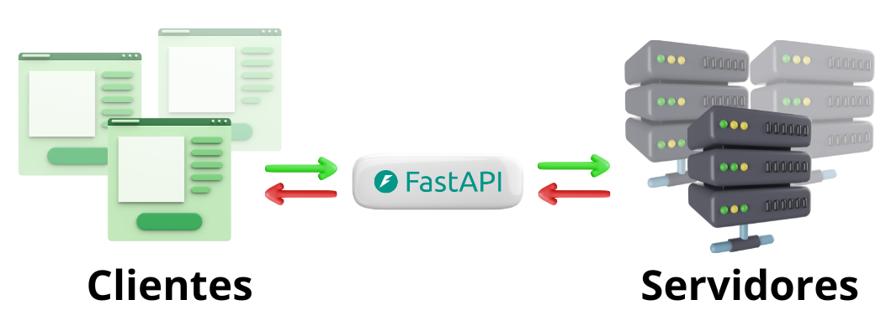

# Modulo 1 - Fundamentos de APIs

### Creadora: Karo Ladino-Puerto

Vamos a empezar con algo que seguramente te parecerá útil y cercano: cómo gestionar reservas en un restaurante local. Vamos a usar FastAPI para crear una API que permita a los clientes reservar mesas en su restaurante favorito.

### ¿Qué es una API?

- **Definición**:
    - Una API (Application Programming Interface) es un conjunto de reglas y definiciones que permiten que dos aplicaciones se comuniquen entre sí. Puedes pensar en una API como un traductor que permite que diferentes sistemas se entiendan y trabajen juntos.
    - **Ejemplo**: Imagina un restaurante que necesita que su sistema de reservas se comunique con una aplicación móvil. La API sería el puente entre ambos, permitiendo que los datos fluyan de una aplicación a otra de manera ordenada y comprensible.

### ¿Cómo funciona una API?

- **Componentes de una API**:
    - **Endpoints**: Son URLs específicas a las que puedes enviar solicitudes para realizar diferentes acciones (como obtener información, enviar datos, actualizar registros o eliminar información). Piensa en ellos como puertas a través de las cuales podemos pedir información al servidor o enviar datos a este.
    - **Solicitudes y Respuestas**:
        - Las solicitudes (*requests*) son los mensajes que envía el cliente (por ejemplo, una aplicación móvil) al servidor, pidiendo que haga algo.
        - Las respuestas (*responses*) son los mensajes que el servidor envía de vuelta al cliente, conteniendo la información solicitada o confirmando que una acción se ha realizado con éxito.
    - **Métodos HTTP**: Son las diferentes maneras en que puedes interactuar con una API. Los más comunes son:
        - **GET**: Para obtener datos (por ejemplo, pedir la lista de reservas).
        - **POST**: Para enviar datos (por ejemplo, crear una nueva reserva).
        - **PUT**: Para actualizar datos existentes (por ejemplo, cambiar la hora de una reserva).
        - **DELETE**: Para eliminar datos (por ejemplo, cancelar una reserva).

### Diagramación de una API

Volvamos al escenario que nos estamos imaginando, tienes un restaurante y quieres permitir que los clientes reserven mesas desde sus teléfonos móviles. Aquí es donde entra la API:

1. **Cliente**: La aplicación móvil que los clientes usan para hacer reservas.
2. **API**: El puente entre la aplicación móvil y el sistema del restaurante.
3. **Servidor**: El sistema del restaurante donde se guardan y gestionan las reservas.

### Usos de las APIs

- **Integración con aplicaciones móviles y web**:
    - Las APIs permiten que las aplicaciones móviles y las páginas web puedan interactuar con los sistemas del restaurante en tiempo real. Por ejemplo, los clientes pueden hacer reservas desde sus teléfonos y el restaurante recibe la información al instante.
- **Automatización de procesos internos**:
    - Las APIs también son útiles para automatizar tareas dentro del restaurante, como la gestión de inventarios, pedidos y reservas, mejorando la eficiencia y reduciendo errores humanos.

### El futuro de las APIs

- **API Economy**:
    - En la economía moderna, las APIs juegan un papel crucial, permitiendo que empresas de diferentes sectores colaboren y compartan servicios. Piensa en cómo Uber usa APIs de mapas y pagos para ofrecer su servicio.
- **Internet de las Cosas (IoT)**:
    - Las APIs son esenciales para conectar dispositivos en el IoT, permitiendo que nuestros dispositivos se comuniquen y trabajen juntos de manera inteligente.
- **Microservicios**:
    - Las APIs permiten construir aplicaciones como un conjunto de servicios pequeños y desacoplados (microservicios), cada uno responsable de una parte específica de la funcionalidad, facilitando el mantenimiento y escalabilidad.

### ¡No olvides la Documentación!

- **Swagger**:
    - Swagger es una herramienta interactiva que permite visualizar y probar los endpoints de una API. Facilita la comprensión de cómo interactuar con la API y probar sus funcionalidades de manera práctica.

---

### Introducción a Python

### ¿Qué es Python?

- **Definición**:
    - Python es un lenguaje de programación de alto nivel, interpretado y de propósito general. Es conocido por su sintaxis clara y legible, lo que lo hace ideal para principiantes y para el desarrollo rápido de aplicaciones.
    - **Ejemplo**: Python es utilizado en una variedad de aplicaciones, desde desarrollo web y análisis de datos hasta inteligencia artificial y automatización de tareas.

### Características de Python

- **Sintaxis clara y legible**: Python está diseñado para ser fácil de leer y escribir, lo que lo hace ideal para principiantes.
- **Multiplataforma**: Python se puede ejecutar en diferentes sistemas operativos como Windows, macOS y Linux.
- **Comunidad amplia y activa**: Python tiene una gran comunidad de desarrolladores que contribuyen con bibliotecas, herramientas y recursos de aprendizaje.

---

### Introducción a FastAPI

### ¿Qué es FastAPI?

- **Definición**:
    - FastAPI es un framework web moderno y de alto rendimiento para construir APIs con Python 3.8+ basado en estándares como OpenAPI y JSON Schema.

### Características de FastAPI

- **Alta Performance**: FastAPI es uno de los frameworks más rápidos disponibles, comparado con NodeJS y Go. ⚡
- **Fácil de usar**: Su diseño se centra en ser fácil de usar, tanto para principiantes como para desarrolladores experimentados.
- **Documentación automática**: Genera automáticamente la documentación de tu API con Swagger.

### ¿Por qué usar FastAPI?

- **Productividad**: Te permite escribir menos código mientras haces más.
- **Validación automática**: Utiliza Pydantic para la validación de datos, lo que ayuda a reducir errores.
- **Interactividad**: Gracias a la documentación automática, puedes interactuar fácilmente con tu API y probarla directamente desde el navegador.

---

### Resumen de conceptos clave

- **API**: Puente de comunicación entre aplicaciones.
- **Endpoints**: URLs específicas para acciones en la API.
- **Solicitudes y Respuestas**: Mensajes enviados y recibidos entre el cliente y el servidor.
- **Métodos HTTP**: GET, POST, PUT, DELETE.
- **Swagger**: Herramienta para documentar y probar APIs.
- **Python**: Lenguaje de programación de alto nivel, fácil de aprender y usar.
- **FastAPI**: Framework web moderno y de alto rendimiento para construir APIs con Python.

---

### Ejercicio de Reflexión

1. **Piensa en una aplicación que usas diariamente (por ejemplo, una app de pedidos de comida). ¿Cómo crees que las APIs ayudan a que esta aplicación funcione?**
2. **¿Qué beneficios ves en tener un sistema de reservas automatizado para un restaurante?**

---

### Preguntas frecuentes

**1. ¿Por qué es importante aprender sobre APIs?**

- Las APIs son fundamentales en el desarrollo moderno de software. Aprender a crear y utilizar APIs te permite construir aplicaciones más integradas y eficientes.

**2. ¿Qué tan difícil es implementar una API?**

- Con herramientas como FastAPI, implementar una API puede ser relativamente sencillo. FastAPI proporciona una estructura clara y herramientas útiles como la documentación automática con Swagger.

**3. ¿Cómo puedo probar mi API?**

- Puedes usar herramientas como Swagger para probar tus endpoints de manera interactiva. También existen otras herramientas como Postman que te permiten enviar solicitudes a tu API y ver las respuestas.

---

¡Felicidades! Ahora tienes una comprensión sólida de los fundamentos de las APIs, Python y FastAPI, y su importancia en el mundo moderno. Continúa explorando y profundizando en estos conceptos en los próximos módulos.