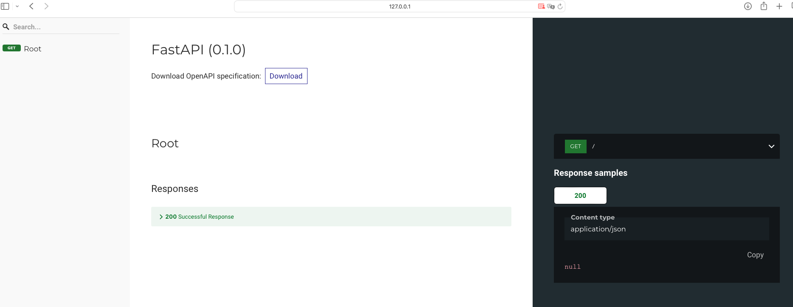

# Módulo 2 - Preparación de tu PC

### Creadoras: Laura López y Valen Ariza

## Configuración de ambiente

Este tutorial te guiará a través de los pasos necesarios para preparar tu PC, cubriremos la instalación de Python 3.10 y FastAPI.

Para utilizar FastAPI debes contar con un entorno controlado, esto se refiere a que vas a crear un entorno para asegurar estabilidad y reproducibilidad de tu código.

### Paso 1: Instalar Python 3.10

1.⁠ ⁠**Descargar Python 3.10**:

- Ve a la página oficial de descargas de Python: [Python.org](https://www.python.org/downloads/)
- Descarga el instalador correspondiente a tu sistema operativo (Windows, macOS o Linux).

2.⁠ ⁠**Instalar Python 3.10**:

- Ejecuta el instalador que descargaste.
- Asegúrate de marcar la opción "Add Python to PATH" antes de continuar con la instalación.
- Sigue las instrucciones del instalador para completar la instalación.

### Paso 2: Instalar FastAPI

1.⁠ ⁠**Crear un entorno virtual**:

- Abre una terminal.
- Usando `cd` navega al directorio donde deseas crear tu proyecto.
- Ejecuta los siguientes comandos:

```bash
# Crear un entorno virtual
python -m venv venv

# Activar el entorno virtual
# En Windows
venv\Scripts\activate

# En macOS/Linux
source venv/bin/activate
```

2.⁠ ⁠**Instalar FastAPI**:

Con el entorno virtual activado, ejecuta:

```bash
pip install fastapi
```

## Creando mi primer ¡Hola mundo!

### Paso 1: Crear un archivo main.py

 Abre `main.py` en tu editor de texto favorito y añade el siguiente código:

```python
 from fastapi import FastAPI

 app = FastAPI()

 @app.get("/")
 async def root():
    return {"message": "Hello World"}
```

Puedes ver la información en el [archivo `main.py`](./main.py).

Algunos editores de texto que te recomendamos:

- Visual Studio Code (VS Code)
- PyCharm

### Paso 2: Ejecutar la aplicación

Ahora vamos a correr la aplicación. Abre una terminal y ejecuta:

```bash
fastapi dev <ruta_del_archivo_main.py>
```

Esto iniciará el servidor y podrás ver la salida en la terminal:


### Paso 3: Accede a la aplicación

Abre tu navegador y ve a http://127.0.0.1:8000. Deberías ver un mensaje de respuesta en formato JSON que dice:

```JSON
{"message": "Hola Mundo"}
```


Además, FastAPI genera automáticamente documentación interactiva para tu API. Puedes acceder a ella en:

**Documentación Swagger UI:** http://127.0.0.1:8000/docs

Esta es una interfaz interactiva que se genera automáticamente para explorar y probar las endpoints de la API directamente desde tu navegador. Puedes personalizarla cambiando el título, la descripción y otros detalles de la documentación.

Permite ver todos los endpoints disponibles en la API, junto con sus métodos HTTP (GET, POST, PUT, DELETE, etc.), parámetros, y descripciones.

Swagger UI utiliza OpenAPI (antes se llamaba swagger), una especificación para describir y documentar APIs de manera detallada y estandarizada, todo este proceso de forma automática. OpenAPI se ha convertido en el estándar de facto para la descripción de APIs REST.


**Documentación ReDoc:** http://127.0.0.1:8000/redoc

Al igual que la documentación Swagger UI, la documentación ReDoc se genera automáticamente en FastAPI y proporciona una manera interactiva para explorar y probar las endpoints de tu API. Es solamente una alternativa visualmente diferente a Swagger UI.

Redoc es compatible con la especificación OpenAPI, lo que significa que puede interpretar y mostrar las especificaciones OpenAPI de tu API de manera clara y precisa.



## Conclusión

¡Y eso es todo! Ahora tienes una aplicación básica de FastAPI que devuelve un mensaje "Hola Mundo".

Puedes expandir esta aplicación añadiendo más rutas y funcionalidades siguiendo los modulos de este repositorio:

- Módulos básicos: [M 3](../M%203/guia-modulo3.md), [M 4](../M%204/guia-modulo4.md), [M 5](../M%205/guia-modulo5.md)
- Módulos intermedios: [M 6](../M%206/guia-modulo6.md), [M 7](../M%207/guia-modulo7.md)
- Módulos avanzados: [M 8](../M%208/guia-modulo8.md), [M 9](../M%209/guia-modulo9.md)
- Módulos extra: [ME 10](../ME%2010/guia-modulo10.md), [ME 11](../ME%2011/guia-modulo11.md)

## Recomendaciones:

Puedes guardar las dependencias como `fastapi` y otras en un archivo `requirements.txt` con sus versiones para que puedas instalarlas fácilmente, y actualizar las versiones controladamente.

El archivo podría contener algo como:

```txt
fastapi ==0.111.0
sqlmodel ==0.0.19
```

Luego de activar tu entorno virtual, puedes instalar todas las dependencias con:

```bash
pip install -r requirements.txt
```

Si quieres saber más puedes dirigirte a la documentación oficial de [FastAPI](https://fastapi.tiangolo.com/learn/).