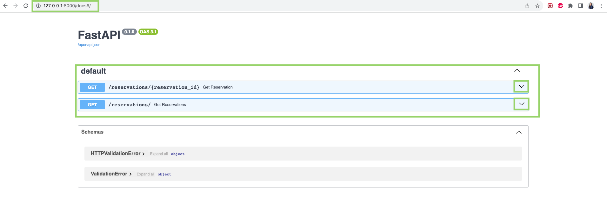
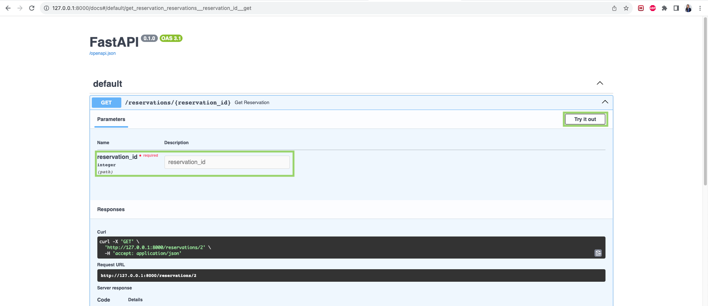
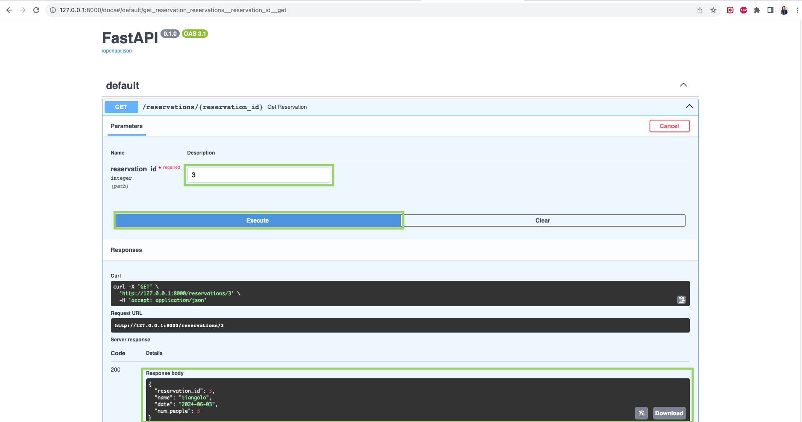

# Módulo 3: Ejemplo básico #1 - Gestión Básica de Reservas

### Creadora: Johana Alarcón

## Descripción

En este módulo, aprenderemos a crear una API sencilla con FastAPI para gestionar reservas de mesas en un restaurante. La API incluirá endpoints para obtener una reserva por ID y obtener todas las reservaciones, con la opción de limitar el número de resultados usando un parámetro de consulta (`query parameter`).

### ¿Qué es un Endpoint?

Un endpoint es una URL específica en una API que actúa como un punto de acceso para realizar acciones como obtener, enviar, actualizar o eliminar datos en un sistema. Utiliza métodos HTTP (como GET, POST, PUT, DELETE) y puede recibir parámetros para especificar detalles adicionales.

### ¿Qué es un Parámetro de Ruta?

Un parámetro de ruta es una parte de la URL que se utiliza para identificar un recurso específico. Por ejemplo, en la URL `/reservations/1`, el `1` es un parámetro de ruta que identifica una reservación específica por su ID.

### ¿Qué es un Parámetro de Consulta?

Un parámetro de consulta es una forma de proporcionar información adicional a un endpoint a través de la URL. Por ejemplo, en la URL `/reservations?limit=5`, el `limit=5` es un parámetro de consulta que limita el número de resultados a 5.

¿Estás lista? ⚡️ ¡Manos a la obra!

## Ejemplo

### Paso 1: Configurar el entorno de desarrollo

Antes de comenzar, asegúrate de tener tu entorno de desarrollo configurado. Te puedes guiar con el [Módulo 2](../M%202/guia-modulo2.md).

### Paso 2: Añadir un Endpoint para obtener una reserva por ID

En un archivo `main.py`, crea una aplicación FastAPI con un endpoint para obtener una reservación específica por ID:

```python
# main.py

from fastapi import FastAPI, HTTPException
from typing import List, Optional

# Inicializa la aplicación FastAPI
app = FastAPI()

# Datos de ejemplo
reservations = [
    {"reservation_id": 1, "name": "Pyladies", "date": "2024-06-01", "num_people": 30},
    {"reservation_id": 2, "name": "alejsdev", "date": "2024-06-02", "num_people": 4},
    {"reservation_id": 3, "name": "tiangolo", "date": "2024-06-03", "num_people": 3},
]

# Define una ruta para obtener una reservación específica por ID
@app.get("/reservations/{reservation_id}")
def get_reservation(reservation_id: int):
    # Itera sobre las reservaciones para encontrar la que coincide con el ID proporcionado
    for reservation in reservations:
        if reservation["reservation_id"] == reservation_id:
            # Si se encuentra la reservación, la retorna
            return reservation
    # Si no se encuentra la reservación, lanza una excepción HTTP 404
    raise HTTPException(status_code=404, detail="Reservation not found")
```

### Paso 3: Añadir un Endpoint para listar reservas

Añade un endpoint para listar todas las reservaciones, con la opción de limitar el número de resultados usando un parámetro de consulta (`query parameter`):

```python
# main.py

from fastapi import FastAPI, HTTPException
from typing import List, Optional

# Inicializa la aplicación FastAPI
app = FastAPI()

# Datos de ejemplo
reservations = [
    {"reservation_id": 1, "name": "Pyladies", "date": "2024-06-01", "num_people": 30},
    {"reservation_id": 2, "name": "alejsdev", "date": "2024-06-02", "num_people": 4},
    {"reservation_id": 3, "name": "tiangolo", "date": "2024-06-03", "num_people": 3},
]

# Define una ruta para obtener una reservación específica por ID
@app.get("/reservations/{reservation_id}")
def get_reservation(reservation_id: int):
    # Itera sobre las reservaciones para encontrar la que coincide con el ID proporcionado
    for reservation in reservations:
        if reservation["reservation_id"] == reservation_id:
            # Si se encuentra la reservación, la retorna
            return reservation
    # Si no se encuentra la reservación, lanza una excepción HTTP 404
    raise HTTPException(status_code=404, detail="Reservation not found")

# Define una ruta para obtener todas las reservaciones con un límite opcional
@app.get("/reservations/")
def get_reservations(limit: int | None = None):
    # Si se proporciona un límite, retorna solo ese número de reservaciones
    if limit:
        return reservations[:limit]
    # Si no se proporciona un límite, retorna todas las reservaciones
    return reservations
```

### Paso 4: Ejecutar el servidor

Ejecuta el servidor con el siguiente comando:

```bash
fastapi dev main.py
```

### Paso 5: Probar la API desde Swagger UI

1. Abre tu navegador web y ve a http://127.0.0.1:8000/docs.
2. Usa los botones "Try it out" en cada endpoint para interactuar con la API:
    - GET /reservations/{reservation_id} para obtener una
    - GET /reservations/ para listar reservas.


Ejemplo:
- Visualización de los endpoints en Swagger UI.



- Despliegue de la sección y clic en el botón "Try it out".



- Prueba de GET.



## ¿Aceptas un reto? 🤓

Ahora que has creado una API básica para gestionar reservas de mesas en un restaurante, aquí tienes un reto para poner a prueba tus habilidades:

Dentro de la función `get_reservation`, agrega una validación para verificar que el `reservation_id` proporcionado sea un número positivo.

## Recursos adicionales

Si quieres aprender más sobre cómo trabajar con parámetros de ruta y de consulta en FastAPI, puedes consultar los siguientes capítulos de la documentación oficial:

📝 [`Path Parameters`](https://fastapi.tiangolo.com/tutorial/path-params/)

📝 [`Query Parameters`](https://fastapi.tiangolo.com/tutorial/query-params//)
