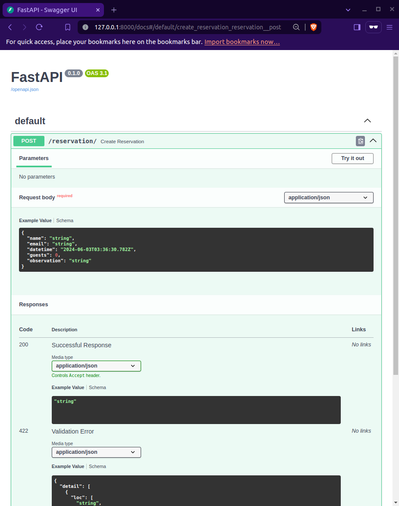
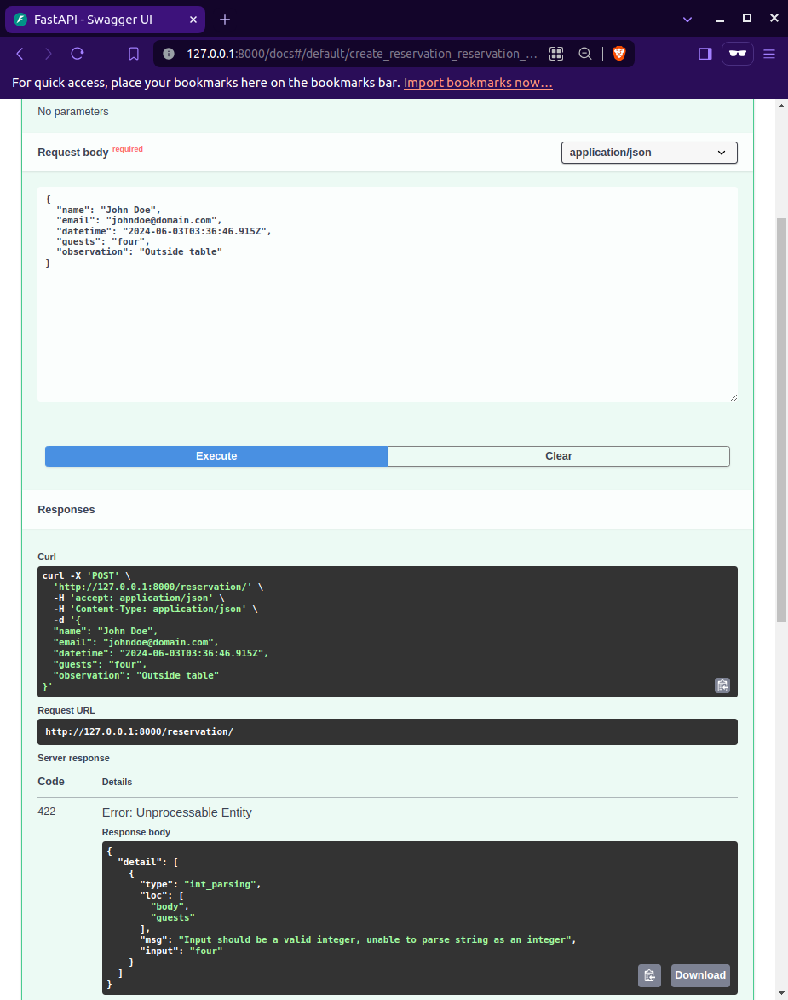

# Módulo 5: Validación de datos con Pydantic 🕵🏻‍♀️ 

### Creadora: Alejandra 

## Descripción

En este módulo aprenderemos a validar datos en FastAPI usando Pydantic.

### ¿Qué es Pydantic?

<a href="https://docs.pydantic.dev/latest/" target="_blank">Pydantic</a> es una librería que nos permite definir modelos de datos y validar los datos que recibimos en nuestra API.

### ¿Por qué es necesario validar datos en una API?

La validación de datos nos permite asegurarnos de que los datos que recibimos son los correctos y cumplen con ciertas reglas o restricciones. Por ejemplo, podemos validar que un campo sea de un cierto tipo, que cumpla con un formato específico, etc.

Sin validación, nuestra API podría recibir datos incorrectos, lo que podría llevar a errores en la aplicación.

## Ejemplo 

Imagina que tienes una API que recibe datos de un formulario en tu app para gestionar reservas en un restaurante. Para asegurarnos de que los datos que recibimos son los correctos, necesitamos validarlos.

### Paso 1: Importar BaseModel de Pydantic

Para usar Pydantic en nuestra API, primero debemos importar la clase `BaseModel` de Pydantic:

```python
from pydantic import BaseModel
```

### Paso 2: Definir un modelo de datos

El siguiente paso es definir un modelo de datos. Un modelo de datos es una clase que hereda de `BaseModel` y define los campos que esperamos recibir en nuestra API.

Por ejemplo, si nuestra API recibe datos de una reservación, podríamos definir un modelo de datos como el siguiente:

```python
from pydantic import BaseModel
from datetime import datetime

class Reservation(BaseModel):
    name: str
    email: str
    datetime: datetime
    guests: int
    observation: str | None = None 
```

### Paso 3: Añadir validaciones adicionales

Pydantic nos permite añadir validaciones adicionales a nuestros campos utilizando `Field`. Por ejemplo, podemos añadir una validación para asegurarnos de que el campo `guests` sea mayor que 0 y menor que 10. Primero, importamos `Field` de Pydantic. Luego, añadimos la validación al campo `guests` utilizando los argumentos `gt` y `lt` en `Field`, que representan "greater than" (mayor que) y "less than" (menor que), respectivamente.

```python
from pydantic import BaseModel, Field
from datetime import datetime

class Reservation(BaseModel):
    name: str
    email: str
    datetime: datetime
    guests: int = Field(..., gt=0, lt=10)
    observation: str | None = None 
```

### Paso 4: Usar el modelo de datos en nuestra API

Para usar este modelo de datos en nuestra API, declaramos el tipo de nuestro argumento con el modelo que creamos:

```python
from fastapi import FastAPI
from pydantic import BaseModel, Field
from datetime import datetime

class Reservation(BaseModel):
    name: str
    email: str
    datetime: datetime
    guests: int = Field(..., gt=0, lt=10)
    observation: str | None = None 

app = FastAPI()

@app.post("/reservation/")
async def create_reservation(reservation: Reservation):
    return reservation
```

### Paso 5: Probar con los docs (Swagger UI)

Si vamos a la URL `/docs` de nuestra API, veremos la documentación generada automáticamente por FastAPI con Swagger UI.

El modelo de datos creado se refleja en la documentación de Swagger, mostrando los campos esperados y sus tipos.



Ahora podemos probar nuestra API enviando datos y ver cómo se validan automáticamente. Si probamos enviando datos válidos, nuestra API enviará una respuesta exitosa.


Por el contrario, si enviamos un campo con algún dato que no cumpla con las reglas definidas en nuestro modelo de datos, Pydantic lanzará una excepción y FastAPI devolverá un error al cliente detalladamente.



## Recursos adicionales

📝 Puedes profundizar más en las secciones de <a href="https://fastapi.tiangolo.com/tutorial/body/" target="_blank">`Request Body`</a> y <a href="https://fastapi.tiangolo.com/tutorial/body-fields/" target="_blank">`Body - Fields`</a> del Tutorial - User Guide de FastAPI.

