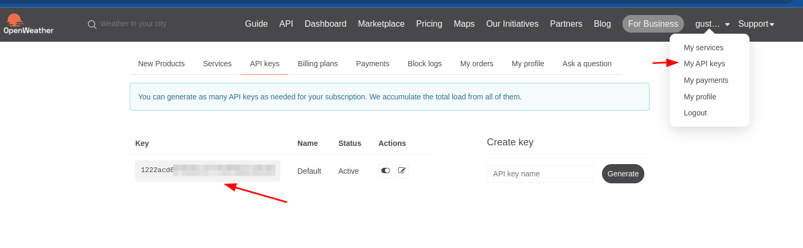
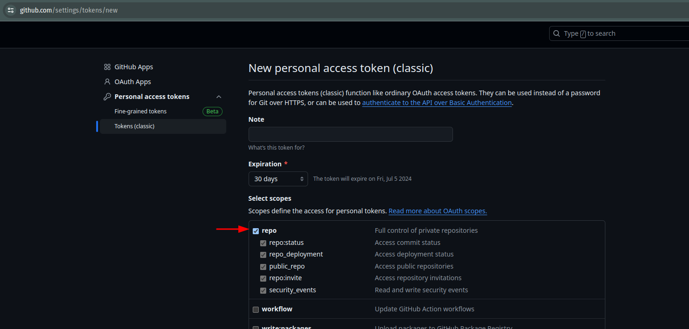

# Módulo 8: Ejemplo Avanzado #1 - Integración con servicios externos

### Creador: Gustavo Díaz

## Descripción

Ahora que has creado tu API, ¿cómo puedes usarla en otras aplicaciones? ¿Cómo integrarte con APIs de terceros? En este módulo, aprenderemos a consultar otras APIs para integrarlas en nuestro desarrollo.

## Un cliente HTTP en Python, HTTPX

Ya sabemos cómo realizar solicitudes a nuestra API mediante clientes gráficos.

En el módulo 2, vimos cómo FastAPI utiliza Swagger para ofrecernos una documentación interactiva que nos permite realizar estas solicitudes. Sin embargo, para poder integrar nuestas aplicaciones con aplicaciones de terceros, necesitaremos un cliente que nos permita automatizar estas solicitudes desde el código, por eso vamos a usar [HTTPX](https://www.python-httpx.org/).

Con HTTPX vamos a poder realizar solicitudes HTTP usando la sintaxis más avanzada de Python. Lo primero que debemos hacer es instalar el paquete en nuestro entorno de desarrollo usando la terminal del sistema:

```sh
> pip install httpx
```

Antes de integrarlo con nuestro aplicación, vemos como funciona HTTPX usando la terminal de python.

El primer paso es importar la librería:

```py
>>> import httpx
```

De esta forma podemos realizar una consulta:

```py
>>> response = httpx.get("https://official-joke-api.appspot.com/jokes/programming/random")
>>> response.json()
[{"type":"programming","setup":"Why did the programmer quit his job?","punchline":"Because he didn't get arrays.","id":18}]
```

Sip, así de sencillo es usar HTTPx.


## Consultando el clima

HTTPx te permite definir cada elemento de una solicitud HTTP: método, esquema, servidor, ruta y cabeceras. 
Es importante estar familiarizado con cada una de estas partes, 
ya que si bien cada API tendrá documentación y firmas diferentes, siempre utilizarán estos mismos elementos.
Se recomienda consultar [Anatomía de una solicitud web](https://www.realisable.co.uk/support/documentation/iman-user-guide/DataConcepts/WebRequestAnatomy.htm) para obtener más información.

Veamos como consultar otra API, [OpenWheather](https://openweathermap.org/current#name). 
Para consultar el clima por ciudad la firma de la consulta es la siguiente:

```http
GET https://api.openweathermap.org/data/2.5/weather?q={city name}&appid={API key}
```


Tenemos dos parámetros para realizar la consulta: `q`, que corresponde al nombre de la ciudad, y `appid`, que es una credencial de usuario. 
¿Credencial de usuario? Sí, es común que las APIs soliciten una identificación para saber quién realiza la solicitud y poder establecer límites en sus respuestas, cabe mencionar que cada solicitud es independiente y no existe un estado que le permita al servidor saber que consultas son del mismo usuario; únicamente la identificación permite al servidor conocer quién realiza cada consulta de manera individual.

Siguiendo con OpenWeather, será necesario crear una cuenta de usuario ingresando en [https://home.openweathermap.org/users/sign_up]. Una vez creada tu cuenta, se te solicitará una confirmación por correo electrónico. Después de realizar la confirmación, podrás acceder a las API Keys.



¡Ahora sí, podemos consultar cómo está el clima en cualquier lugar del mundo desde la terminal de python!

```py
>>> API_KEY = "<YOUR_API_KEY>"
>>> CITY = "london"
>>> response = httpx.get("https://api.openweathermap.org/data/2.5/weather", params={"q":CITY, "appid":API_KEY})
>>> response.json()
{'coord': {'lon': -0.1257, 'lat': 51.5085},
'weather': [{'id': 800,
'main': 'Clear',
'description': 'clear sky',
'icon': '01d'}],
'base': 'stations',
'main': {'temp': 288.28,
'feels_like': 287.18,
'temp_min': 286.34,
'temp_max': 289.92,
'pressure': 1013,
'humidity': 51},
'visibility': 10000,
'wind': {'speed': 5.66, 'deg': 250},
'clouds': {'all': 5},
'dt': 1717583136,
'sys': {'type': 2,
'id': 2075535,
'country': 'GB',
'sunrise': 1717559169,
'sunset': 1717618336},
'timezone': 3600,
'id': 2643743,
'name': 'London',
'cod': 200}
```

Pero parce, ¿por qué London? ¡FastAPI es de Medallo!

```py
>>> CITY = "medallo"
>>> response = httpx.get("https://api.openweathermap.org/data/2.5/weather", params={"q":CITY, "appid":API_KEY})
>>> response.json()
{'cod': '404', 'message': 'city not found'}
>>> response.status_code
404
```

Digo, de *Medellín*, pero bueno, aprovechando el error, el objeto `response` retornado por una solicitud realizada con `httpx` no solo contiene el cuerpo de la respuesta, también contiene el `código` y las `cabeceras`. Estos elementos pueden darnos información adicional. En este caso, el código 404 significa que el recurso solicitado no fue encontrado. 

¿Cómo saber qué significa cada código? Tranquilo, las referencias son fáciles de encontrar en internet: [Lista de Códigos HTTP](https://en.wikipedia.org/wiki/List_of_HTTP_status_codes#404).


## Integración con FastAPI

Como desarrollador, es posible que uses GitHub para tus proyectos o para aportar a otros proyectos. 
¿Qué te parecería tener un servicio que liste tus repositorios? ¡GitHub tiene una API REST para eso!

Nuevamente, vamos a necesitar una credencial. 
En este caso, usaremos un `token` temporal que generaremos entrando a la página [GitHub Settings](https://github.com/settings/tokens). 
Selecciona los permisos de `repo` y genera el token.



Puedes realizar la solicitud para listar tus repos de Github de la siguiente manera.

```py
>>> token = '<YOUR_TOKEN>'
>>> username = '<YOUR_GITHUB_USERNAME>'

>>> headers = {'Authorization': f'token {token}'}
>>> url = f'https://api.github.com/users/{username}/repos'
>>> response = httpx.get(url, headers=headers)
>>> response.json()
```

Github maneja las credeciales de manera diferente, las envía en las cabeceras usando la llave `Autorization`, 
igual no es problema HTTPX puede manejarlo!

Integrarlo a FastApi es muy sencillo, 
crea un archivo main con el siguiente contenido y ejecuta el servidor como se ha explicado en anteriores modulos:

```py
# main.py
from fastapi import FastAPI

token = '<YOUR_TOKEN>'
username = '<YOUR_GITHUB_USERNAME>'

app = FastAPI()

@app.get("/repos")
async def root():
    headers = {'Authorization': f'token {token}'}
    url = f'https://api.github.com/users/{username}/repos'
    response = httpx.get(url, headers=headers)
    return response.json()
```

Accede a la documentación de FastApi ¡ya debes tener un endpoint para consultar directamente tus repositorios!

¿Como modificarías el anterior código para manejar los errores? 
recuerda que el objeto response el atributo `status_code`.


## Ejercicios y profundización

### HTTPX async

Una de las fortalezas de HTTPX frente a otros clientes HTTP es su capacidad para ejecutarse con la sintaxis `async`. 
Al usar `async`, la espera por las respuestas de las solicitudes HTTP no bloquea la recepción de nuevas solicitudes, 
lo que mejora significativamente el rendimiento de nuestra aplicación. Sobre esto se hablará más en el módulo 11.

Como ejercicio, se recomienda instalar la terminal de Python `ipython`.

Esta terminal permite usar la sintaxis `async`, por lo que podrás probar ejecutar HTTPX de la siguiente forma:

```python
>>> import httpx
>>> client = httpx.AsyncClient()
>>> response = await client.get("https://official-joke-api.appspot.com/jokes/programming/random")
>>> response.json()
[{"type":"programming","setup":"Why did the programmer quit his job?","punchline":"Because he didn't get arrays.","id":18}]
```

En un script, no hay mucha diferencia en usar `await`,
pero te permitirá hacer pruebas para modificar luego el código del servidor.

### Manejo de secretos

No es buena práctica quemar las credenciales en el código, existen buenas prácticas para el manejo de la información que debería ser secreta. 
Si como manejar la configuración y los secretos es de tu interes, te recomiendo consultar [Pydantic Settings](https://docs.pydantic.dev/latest/concepts/pydantic_settings/#usage).
¿Te gustaría un módulo sobre pydantic-settings?
