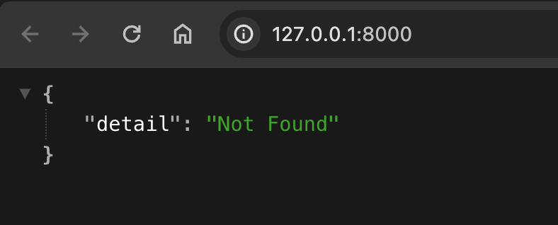
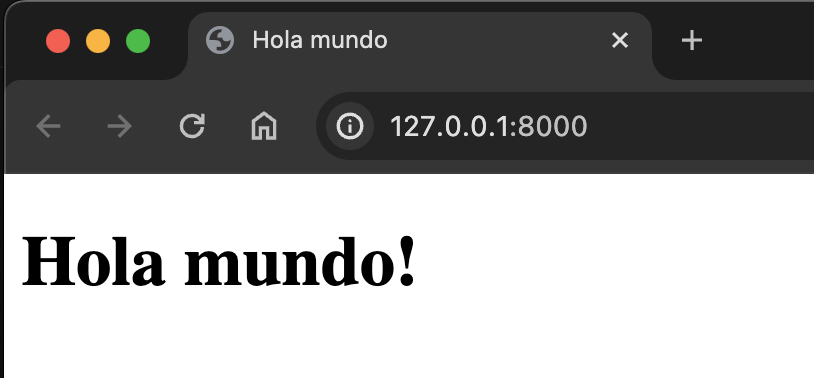
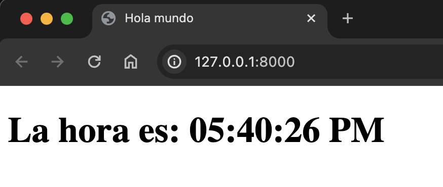
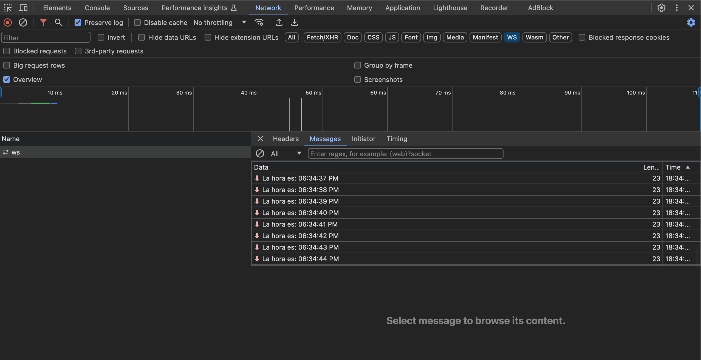
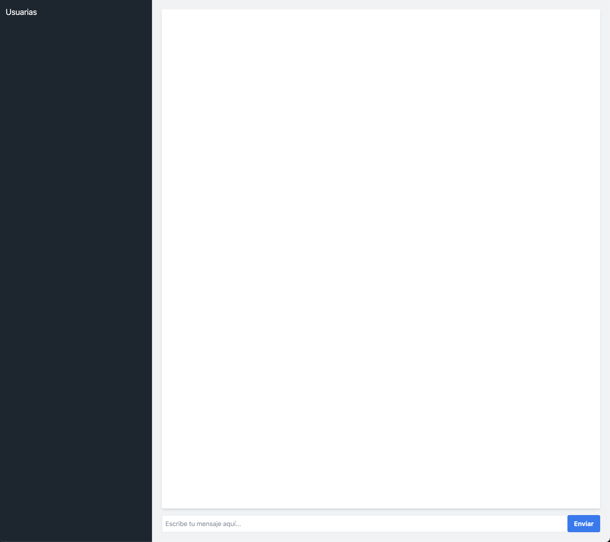

# Módulo 9
## Ejemplo Avanzado #2 - WebSockets en FastAPI

### Creadora: Julián Amaya

---

### Introducción a los WebSockets

Antes de empezar, un poco de historia. Como dice la canción, la historia se repite…

[](https://www.youtube.com/watch?v=yzLT6_TQmq8&ab_channel=WallofSoundRecording)

En los años 60 y 70, los computadores eran enormes y ocupaban salas enteras. En ese entonces, los servidores hacían todo el trabajo pesado, mientras que los clientes (las terminales) eran dispositivos muy simples que solo mostraban la información.

Avanzando a los 80 y 90, las computadoras personales (PCs) se volvieron más comunes y poderosas. Ahora, los clientes podían hacer más trabajo, como ejecutar aplicaciones complejas, mientras que los servidores seguían manejando el almacenamiento y el procesamiento de datos a gran escala.

En los 90 y principios de los 2000, la web se convirtió en una parte fundamental de nuestras vidas. Los primeros navegadores web eran bastante simples y se enfocaban en mostrar información estática, como texto e imágenes. Esto nos llevó de vuelta a un modelo donde los clientes eran relativamente livianos y los servidores manejaban la mayor parte del trabajo.

Con el tiempo, las aplicaciones web se volvieron más interactivas y complejas. Empezamos a ver aplicaciones que no solo mostraban información, sino que también permitían a los usuarios interactuar de maneras más ricas y dinámicas. Esto llevó a la necesidad de que los clientes (navegadores) pudieran manejar más trabajo en tiempo real.

### La necesidad de los WebSockets

En este contexto, los WebSockets nacieron para llenar un vacío. Aunque el protocolo HTTP funcionaba bien para muchas tareas, no era ideal para aplicaciones que necesitaban actualizarse constantemente, como los chats en tiempo real, los juegos multijugador o las aplicaciones de monitoreo en vivo. Los WebSockets permiten una comunicación bidireccional y continua entre el cliente y el servidor, lo que facilita una experiencia más fluida e interactiva.

### ¿Qué son los WebSockets?

Los WebSockets son un protocolo de comunicación que proporciona canales de comunicación bidireccionales y en tiempo real sobre una única conexión TCP. A diferencia del protocolo HTTP tradicional, que sigue un modelo de solicitud-respuesta, los WebSockets permiten que tanto el cliente como el servidor envíen datos de manera independiente y continua sin la necesidad de abrir nuevas conexiones.

---

## Ejemplo 1: Logrando la conexión

Afortunadamente, FastAPI hace que sea **muy** fácil crear una conexión con websockets.

Ahora, tenemos que escribir código en JS para poder crear la conexión desde el navegador.

Vamos a crear un servidor sencillo que sirve una página con el JS necesario.

Lo primero es, como siempre, iniciar la aplicación de FastAPI. Tenemos el archivo [main.py](http://main.py) con lo siguiente:

```python
from fastapi import FastAPI, WebSocket
from fastapi.responses import HTMLResponse
import asyncio
import random

app = FastAPI()
```

Si corremos la aplicación usando:

```bash
fastapi dev main.py 
```

Tendremos como resultado en nuestro navegador:



Ahora, vamos a mostrar nuestro “sitio” sencillo agregando un html.

Para motivos del ejemplo y **sólo para el ejemplo** (en serio!) vamos a retornar el html como un string. Para hacerlo, debemos agregar un import:

```python
from fastapi.responses import HTMLResponse
```

Y agregar una vista que responda el html:

```python

html = """
<!DOCTYPE html>
<html>
    <head>
        <title>Hola mundo</title>
    </head>
    <body>
        <h1>Hola mundo!</h1>
    </body>
</html>
"""

@app.get("/")
async def get():
    return HTMLResponse(html)

```



Ahora, creemos la conexión del websocket!

Primero, tenemos que importar el módulo de Websocket. Adicionalmente, para el ejemplo que haremos, importemos adicionalmente, datetime y asyncio

```python
from fastapi import FastAPI, WebSocket
import datetime
import asyncio
```

> **[!TIP]**
Este módulo es realmente el módulo de Starlette que FastAPI nos ayuda a importar de manera sencilla 🙂
> 

Luego, modifiquemos el html para que incluya un script de Javascript que cuando reciba un mensaje por un websocket, reemplace el contenido del sitio con el mensaje:

```python
html = """
<!DOCTYPE html>
<html>
    <head>
        <title>Hola mundo</title>
    </head>
    <body>
        <h1>Hola mundo!</h1>
        <script>
            var ws = new WebSocket("ws://localhost:8000/ws");
            ws.onmessage = function(event) {
                var server_message = event.data;
                document.body.innerHTML = '<h1>' + server_message + '</h1>';
            };
        </script>
    </body>
</html>
"""
```

Finalmente, tenemos que agregar una nueva vista de tipo websocket.

```python

@app.websocket("/ws")
async def websocket_endpoint(websocket: WebSocket):
    await websocket.accept()
    while True:
        now = datetime.datetime.now().strftime("%I:%M:%S %p")
        await websocket.send_text(f"La hora es: {now}")
        await asyncio.sleep(1)
```

Si corremos la aplicación, ahora veremos:



Ahora, cómo podemos *debuggear* la conexión y lo que estamos recibiendo?

Para hacerlo, podemos abrir las herramientas del desarrollador en nuestro navegador e ir a la pestaña de “Network”



De esta forma podemos ver los mensajes que recibimos del servidor! Cómo ven, sólo una conexión se hace al servidor y dentro de ella podemos ver múltiples mensajes!

El código completo de este primer ejercicio está en `ejemplos/reloj.py` .

---

## Ejemplo 2: Chat Comunitario en Tiempo Real

Para poner esto en práctica, vamos a construir una aplicación de chat comunitario en tiempo real. Este chat permitirá que las integrantes de Pyladies puedan comunicarse instantáneamente, organizando eventos, coordinando en emergencias y fortaleciendo los lazos comunitarios. 💜

---

### Paso 1:

Vamos a partir del ejemplo anterior. Si no lo han hecho, puedes copiar el archivo `ejemplos/main.py` 

```python
from fastapi import FastAPI, WebSocket, WebSocketDisconnect
from fastapi.responses import HTMLResponse
import asyncio
from typing import Dict
import json

app = FastAPI()

```

### Paso 2: Creación de la interfaz de usuario

Creamos un archivo HTML sencillo que actuará como la interfaz de nuestro chat comunitario.

```python
html = """
<!DOCTYPE html>
<html>
    <head>
        <title>Chat Pyladies</title>
        <link href="https://cdn.jsdelivr.net/npm/tailwindcss@2.1.4/dist/tailwind.min.css" rel="stylesheet">
    </head>
    <body class="bg-gray-100" onload="solicitarNombreUsuario()">
        <div class="flex flex-row h-screen">
            <div class="bg-gray-800 text-white w-1/4 p-4">
                <h2 class="text-xl mb-2">Usuarias</h2>
                <ul id="usuarios" class="overflow-y-auto"></ul>
            </div>
            <div class="flex flex-col w-3/4 p-6">
                <div class="flex-1 bg-white overflow-y-auto p-4 mb-4 rounded shadow-md">
                    <ul id="mensajes"></ul>
                </div>
                <div class="flex">
                    <input type="text" id="entradaMensaje" class="border p-2 flex-grow" placeholder="Escribe tu mensaje aquí..." onkeypress="if(event.keyCode == 13) { enviarMensaje(); }">
                    <button onclick="enviarMensaje()" class="bg-blue-500 hover:bg-blue-700 text-white font-bold py-2 px-4 rounded">Enviar</button>
                </div>
            </div>
        </div>
        <script>
            var ws;
            var mensajes = document.getElementById('mensajes');
            var usuarios = document.getElementById('usuarios');
            var entradaMensaje = document.getElementById('entradaMensaje');
            var nombreUsuario;

            function solicitarNombreUsuario() {
                nombreUsuario = prompt("Por favor, ingresa tu nombre:");
                if (nombreUsuario) {
                    ws = new WebSocket("ws://localhost:8000/ws?nombre_usuario=" + encodeURIComponent(nombreUsuario));
                    configurarWebSocket();
                }
            }

            function configurarWebSocket() {
                ws.onmessage = function(evento) {
                    var datosParseados = JSON.parse(evento.data);
                    if (datosParseados.tipo === 'mensaje') {
                        mensajeActual = JSON.parse(datosParseados.mensaje)
                        mensajes.innerHTML += '<li class="p-2 border-b"><strong>' + datosParseados.usuario + ':</strong> ' + mensajeActual.mensaje + '</li>';
                    } else if (datosParseados.tipo === 'lista_usuarios') {
                        usuarios.innerHTML = '';
                        datosParseados.usuarios.forEach(function(usuario) {
                            usuarios.innerHTML += '<li class="p-2 border-b">' + usuario + '</li>';
                        });
                    }
                };
            }

            function enviarMensaje() {
                var mensaje = entradaMensaje.value;
                ws.send(JSON.stringify({tipo: 'mensaje', mensaje: mensaje}));
                entradaMensaje.value = '';
            }
        </script>
    </body>
</html>
"""
```

Se ve bastante complejo, pero en realidad, este HTML hace uso de Tailwind para mostrar una interfaz similar a un chat (y es responsive!)

Ahora, notarás varias funciones en Javascript:

```jsx
function solicitarNombreUsuario() {
    nombreUsuario = prompt("Por favor, ingresa tu nombre:");
    if (nombreUsuario) {
        ws = new WebSocket("ws://localhost:8000/ws?nombre_usuario=" + encodeURIComponent(nombreUsuario));
        configurarWebSocket();
    }
}

function configurarWebSocket() {
    ws.onmessage = function(evento) {
        var datosParseados = JSON.parse(evento.data);
        if (datosParseados.tipo === 'mensaje') {
            mensajeActual = JSON.parse(datosParseados.mensaje)
            mensajes.innerHTML += '<li class="p-2 border-b"><strong>' + datosParseados.usuario + ':</strong> ' + mensajeActual.mensaje + '</li>';
        } else if (datosParseados.tipo === 'lista_usuarios') {
            usuarios.innerHTML = '';
            datosParseados.usuarios.forEach(function(usuario) {
                usuarios.innerHTML += '<li class="p-2 border-b">' + usuario + '</li>';
            });
        }
    };
}

function enviarMensaje() {
    var mensaje = entradaMensaje.value;
    ws.send(JSON.stringify({tipo: 'mensaje', mensaje: mensaje}));
    entradaMensaje.value = '';
}
```

Aunque no entraremos en detalle de todas, la más interesante/compleja es la 2da: nos muestra cómo recibir a través del mismo Websocket al backend múltiples tipos de mensaje, en este caso, mandaremos el listado de usuarios y el mensaje de un usuario. De esta forma vamos a poder saber: cuando alguien se conecta y cuando alguien envíe un mensaje.

### Paso 3: Servir la página HTML desde FastAPI

Similar al ejemplo anterior, definimos una ruta en nuestra aplicación FastAPI que servirá el HTML para la interfaz de usuario.

```python
@app.get("/")
async def obtener():
    return HTMLResponse(html)

```

Agregando esto, vamos a poder ver ya el chat! 



(¡Aunque aún no funciona! 🫠)

### Paso 4: Gestión de conexiones WebSocket

Creamos una clase `AdministradorConexiones` para manejar las conexiones activas de WebSocket. Esta clase se encargará de conectar, desconectar y transmitir mensajes a las usuarias.

```python
class AdministradorConexiones:
    def __init__(self):
        self.conexiones_activas: Dict[str, WebSocket] = {}

    async def conectar(self, websocket: WebSocket, nombre_usuario: str):
        await websocket.accept()
        self.conexiones_activas[nombre_usuario] = websocket
        await self._transmitir_lista_usuarios()

    def desconectar(self, websocket: WebSocket):
        nombre_usuario = next((usuario for usuario, ws in self.conexiones_activas.items() if ws == websocket), None)
        if nombre_usuario:
            del self.conexiones_activas[nombre_usuario]
            asyncio.create_task(self._transmitir_lista_usuarios())

    async def enviar_mensaje_personal(self, mensaje: str, websocket: WebSocket):
        await websocket.send_text(mensaje)

    async def transmitir(self, mensaje: str, nombre_usuario: str):
        for usuario, conexion in self.conexiones_activas.items():
            await conexion.send_text(mensaje)

    async def _transmitir_lista_usuarios(self):
        lista_usuarios = list(self.conexiones_activas.keys())
        await self.transmitir(json.dumps({'tipo': 'lista_usuarios', 'usuarios': lista_usuarios}), None)

administrador = AdministradorConexiones()
```

¿Qué hace esta clase? Maneja un listado de conexiones de Websocket, una por cada usuaria. Cuando una nueva usuaria se conecta, se llama función `conectar` que:

1. Agrega la nueva conexión al listado de conexiones
2. Envia a la nueva usuaria el listado de usuarias conectadas

La otra función importante es `transmitir` que lo que hace es enviar un mensaje de una usuaria a todas las usuarias (incluyendo a la usuaria inicial 😬). Esto permite que cuando una escriba, todas reciban el mensaje!

Al final inicializamos esta clase para que se pueda usar!

### Paso 5: Endpoint WebSocket para manejar conexiones

Definimos un endpoint WebSocket que manejará las conexiones entrantes, enviará y recibirá mensajes.

```python
@app.websocket("/ws")
async def endpoint_websocket(websocket: WebSocket, nombre_usuario: str = ""):
    if not nombre_usuario:
        await websocket.close(code=1000, reason="No se proporcionó nombre de usuario")
        return
    await administrador.conectar(websocket, nombre_usuario)
    try:
        while True:
            datos = await websocket.receive_text()
            await administrador.transmitir(json.dumps({'tipo': 'mensaje', 'usuario': nombre_usuario, 'mensaje': datos}), nombre_usuario)
    except WebSocketDisconnect:
        administrador.desconectar(websocket)
    except Exception as e:
        print(f"Error: {e}")

```

### Paso 6: Ejecución de la aplicación

Finalmente, ejecutamos nuestra aplicación FastAPI usando Uvicorn.

```python
if __name__ == "__main__":
    import uvicorn
    uvicorn.run(app, host="127.0.0.1", port=8000)

```

Y… ya funciona el chat! Podrás abrir multiples ventanas y chatear entre ellas!

Pero… y si quiero que alguien use mi aplicación?!

Debo pasarle mi dirección IP… funciona?

No, debo hacer un pequeño cambio y correr mi aplicación en el host `0.0.0.0` 

Para hacerlo ejecuta el servidor:

```bash
fastapi dev chat.py --host 0.0.0.0
```

De esa manera, tu servidor de prueba recibirá conexiones incluso desde otros computadores!

### Resumen

En este ejemplo, hemos creado una aplicación de chat en tiempo real donde las usuarias pueden conectarse, enviar mensajes y ver la lista de usuarias conectadas. 

Hay muchos pasos por hacer como por ejemplo:

1. Si el servidor se desconecta, volver a reconectarte! (Pista, esto debería ocurrir en JS!)
2. Persistir en la base de datos los mensajes
3. Agregar soporte para imágenes!

# Conclusión

Los Websockets son una herramienta muy poderosa a la hora de construir aplicaciones. Permiten cambiar el paradigma donde un cliente consulta al servidor cuando quiere obtener información y permite que el servidor decida cuando debe enviar la información al cliente.

Aunque FastAPI hace muy simple su implementación hay que tener en cuenta varias cosas a la hora de implementarlo:

1. Para el servidor, son más pesados de mantener que una conexión normal, así que sólo úsalos si realmente lo necesitas
2. No puedes asegurar que un cliente recibió un mensaje — por lo que si necesitas asegurar el manejo de información crítica, tu código deberá validar esto
3. Son muy divertidos de usar 😀

Gracias por participar!

## Nota:

Por favor no usen strings para responder HTMLs. Aunque para el ejercicio o pruebas rápidas es válido, no es ideal y en producción hay muchas mejores prácticas. Si lo hacen, deberán enviarle este meme a Tiangolo, el creador de FastAPI:


