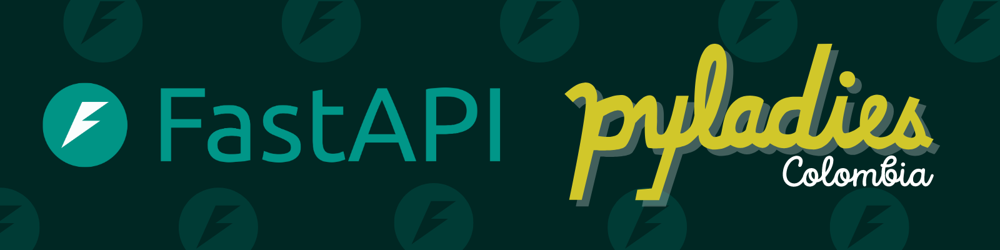

# **Taller FastAPI**

❇️ Si tienes alguna duda escríbenos a [bogota@pyladies.com](mailto:bogota@pyladies.com) 

---

## ¡Bienvenidas!

Hola, hola, holaaaaa, bienvenida al taller de FastAPI 🎉 Gracias por estar aquí y leernos. Hemos creado este taller en Junio de 2024. Aquí puedes encontrar ejercicios para aprender sobre FastAPI. ¡Qué alegría que estemos juntas en este camino! Te deseamos lo mejor y queremos que sepas que estamos aquí para ti. Si tienes alguna duda, no dudes en unirte a nuestra comunidad y compartirla con nosotras. Estamos listas para ayudarte en lo que necesites. 

Canales de [PyLadies Colombia](https://linktr.ee/pyladies_co)

## Metodología

Este taller es autoguiado. Está diseñado para que puedas comenzar en cualquier módulo y navegar a través de todos ellos, así como por sus distintos niveles. A continuación, te presentamos la estructura del taller para que elijas por dónde quieres empezar.

## Estructura del taller

- M 1: [Fundamentos sobre APIs](../M%201/guia-modulo1.md)
- M 2: [Configuración de tu PC y entorno](../M%202/guia-modulo2.md)
- M 3: [Ejemplo #1 - Nivel básico](../M%203/guia-modulo3.md)
- M 4: [Ejemplo #2 - Nivel básico](../M%204/guia-modulo4.md)
- M 5: [Ejemplo #3 - Nivel básico](../M%205/guia-modulo5.md)
- M 6: [Ejemplo #1 - Nivel intermedio](../M%206/guia-modulo6.md)
- M 7: [Ejemplo #2 - Nivel intermedio](../M%207/guia-modulo7.md)
- M 8: [Ejemplo #1 - Nivel avanzado](../M%208/guia-modulo8.md)
- M 9: [Ejemplo #2 - Nivel avanzado](../M%209/guia-modulo9.md)
- ME 10: [Anotaciones en Python](../M%2010/guia-modulo10.md)
- ME 11: [Concurrencia y Async](../M%2011/guia-modulo11.md)

> **Nota 1**: ME significa módulo extra.
> 
> **Nota 2:** Recuerda elegir el módulo con el que quieras empezar.

## **Para iniciar el taller necesitas**

- Si no tienes experiencia con API, te invitamos empezar por el módulo M 1
- Si no tienes tu PC o entorno configurado, te invitamos pasar por el módulo M 2

## ¿Quieres traducirlo a otros idiomas?

✳️ Este taller tiene mucho amor, está abierto para mejoras, así que si quieres aportar envíanos tu PR.  Abre un [issue nuevo](https://github.com/pyladies-colombia/fastapi/issues/new) aquí. 

## Versiones de eventos

- 1ra versión: Junio 6 de 2024, 5:00 p. m. a 8:00 p. m. ([Evento](https://www.instagram.com/p/C7mMc58A_zc/))

---

## **Licencia**

Este trabajo está bajo de la licencia [Creative Commons Attribution-NonCommercial-ShareAlike 4.0 International License](http://creativecommons.org/licenses/by-nc-sa/4.0/).